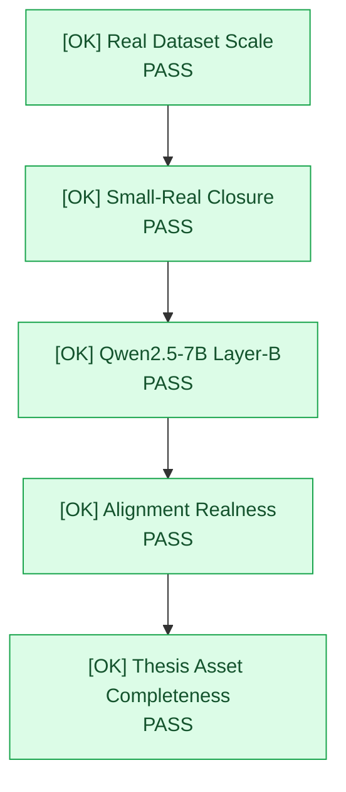
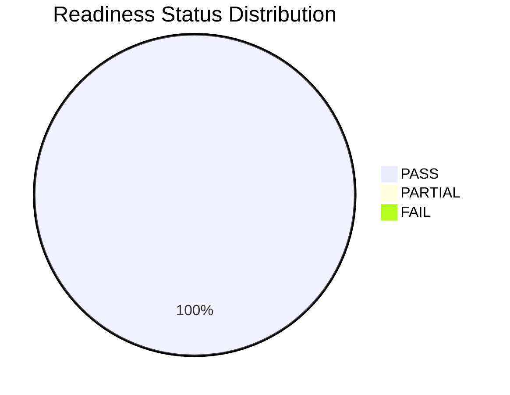

# Conclusion Dashboard (Mermaid)

```mermaid
flowchart TD
  N1["[OK] Real Dataset Scale\nPASS"]
  N2["[OK] Small-Real Closure\nPASS"]
  N3["[OK] Qwen2.5-7B Layer-B\nPASS"]
  N4["[OK] Alignment Realness\nPASS"]
  N5["[OK] Thesis Asset Completeness\nPASS"]
  N1 --> N2
  N2 --> N3
  N3 --> N4
  N4 --> N5
  classDef pass fill:#dcfce7,stroke:#16a34a,stroke-width:1px,color:#14532d;
  classDef partial fill:#fef9c3,stroke:#ca8a04,stroke-width:1px,color:#713f12;
  classDef fail fill:#fee2e2,stroke:#dc2626,stroke-width:1px,color:#7f1d1d;
  class N1 pass
  class N2 pass
  class N3 pass
  class N4 pass
  class N5 pass
```

```mermaid
pie title Readiness Status Distribution
  "PASS" : 5
  "PARTIAL" : 0
  "FAIL" : 0
```
