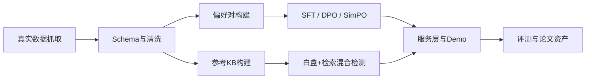

# Figure: Pipeline Flow (Mermaid)

```mermaid
flowchart LR
  A["真实数据抓取"] --> B["Schema与清洗"]
  B --> C["偏好对构建"]
  C --> D["SFT / DPO / SimPO"]
  B --> E["参考KB构建"]
  E --> F["白盒+检索混合检测"]
  D --> G["服务层与Demo"]
  F --> G
  G --> H["评测与论文资产"]
```
