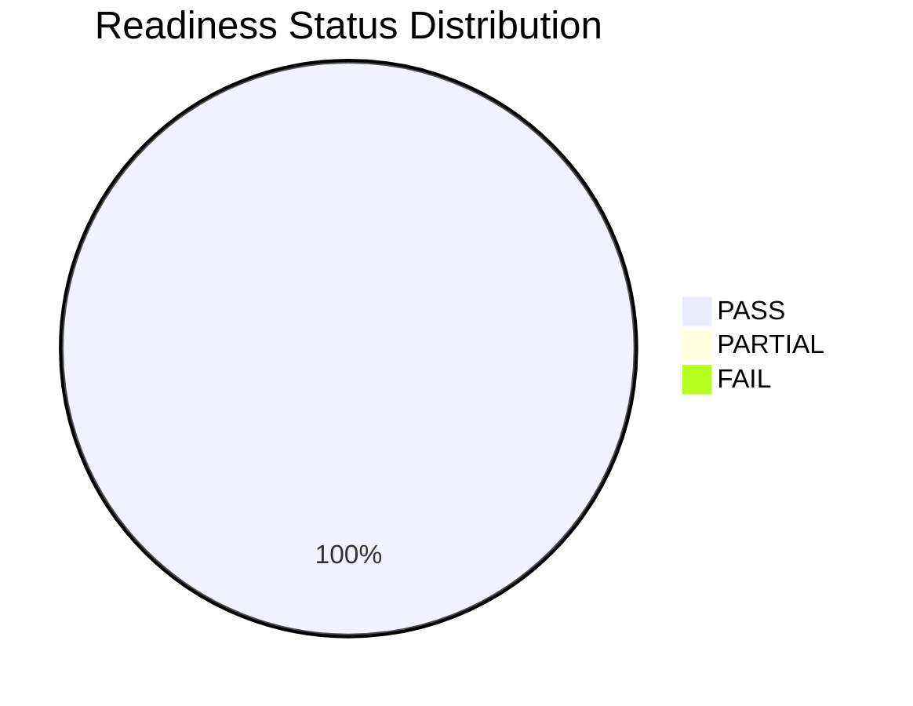

# Thesis Ready Summary

- Generated(UTC): 2026-03-02T13:50:30.895538+00:00
- Latest Small-Real Run: small_real_lora_v13

## Main Result Table
- CSV: `reports/thesis_assets/tables/main_results_small_real.csv`
- Real CSV: `reports/thesis_assets/tables/main_results_real.csv`
- Proxy CSV: `reports/thesis_assets/tables/main_results_proxy.csv`
- Dual View(MD): `reports/thesis_assets/tables/main_results_dual_view.md`

## Ablation/Control Table
- CSV: `reports/thesis_assets/tables/ablation_small_real_runs.csv`

## Alignment (Real DPO) Table
- CSV: `reports/thesis_assets/tables/alignment_real_dpo_runs.csv`

## DPO Beta Ablation
- CSV: `reports/thesis_assets/tables/dpo_beta_ablation.csv`

## Conclusion Dashboard
- Overall: [OK] READY
- CSV: `reports/thesis_assets/tables/conclusion_status_dashboard.csv`
- Mermaid: `reports/thesis_assets/figures/conclusion_dashboard_mermaid.md`

## Visual Charts (PNG/PDF)
- `reports/thesis_assets/figures/loss_curve_latest.png`
- `reports/thesis_assets/figures/alignment_metrics_bar.png`
- `reports/thesis_assets/figures/train_loss_compare_bar.png`
- `reports/thesis_assets/figures/dpo_beta_curve.png`
- `reports/thesis_assets/figures/conclusion_status_bar.png`
- `reports/thesis_assets/figures/figure_manifest.json`

### Iconized Status
- [OK] Real Dataset Scale: PASS | evidence=`reports/real_dataset_summary.json` | train/dev/test=70054/8755/8755
- [OK] Small-Real Closure: PASS | evidence=`reports/small_real/small_real_lora_v13/run_card.json` | latest_run=small_real_lora_v13
- [OK] Qwen2.5-7B Layer-B: PASS | evidence=`reports/training/layer_b_qwen25_7b_sft_metrics.json` | mainline ready
- [OK] Alignment Realness: PASS | evidence=`reports/training/dpo_real_metrics.json` | real_methods=3/3
- [OK] Thesis Asset Completeness: PASS | evidence=`reports/thesis_assets/tables/main_results_dual_view.md` | asset_checks=4/4

### Visual Conclusion (Mermaid)

## Supporting Evidence
- Baseline Audit: `reports/thesis_assets/tables/baseline_audit_table.csv`
- Baseline Real Mainline: `reports/thesis_assets/tables/baseline_real_mainline.csv`
- Baseline Proxy Background: `reports/thesis_assets/tables/baseline_proxy_background.csv`
- Baseline Dual View: `reports/thesis_assets/tables/baseline_audit_dual_view.md`
- Error Cases: `reports/thesis_assets/cases/error_cases_top30.jsonl`

## Thesis Writing Notes
- 主结果口径: 主结果采用 real/proxy 双层分表；small-real 仅作为工程闭环证据，不作为最终主结论。
- 消融口径: Across small_real_lora_v* runs to verify reproducibility and run stability.
- 对齐口径: real/proxy 按 simulation 标记自动分层呈现，禁止跨口径直接比较绝对数值。
- 局限性: 当前主链（含 Qwen2.5-7B Layer-B）已具备可复现实验资产，剩余工作为扩展消融与跨数据集验证。
- 下一步: 在 GPU 环境执行 full-scale 消融（长度/数据规模/对齐算法）并刷新主结果表。
- 可视化结论: 结论状态看板已生成（图标+Mermaid），可直接粘贴进论文实验总结章节。
